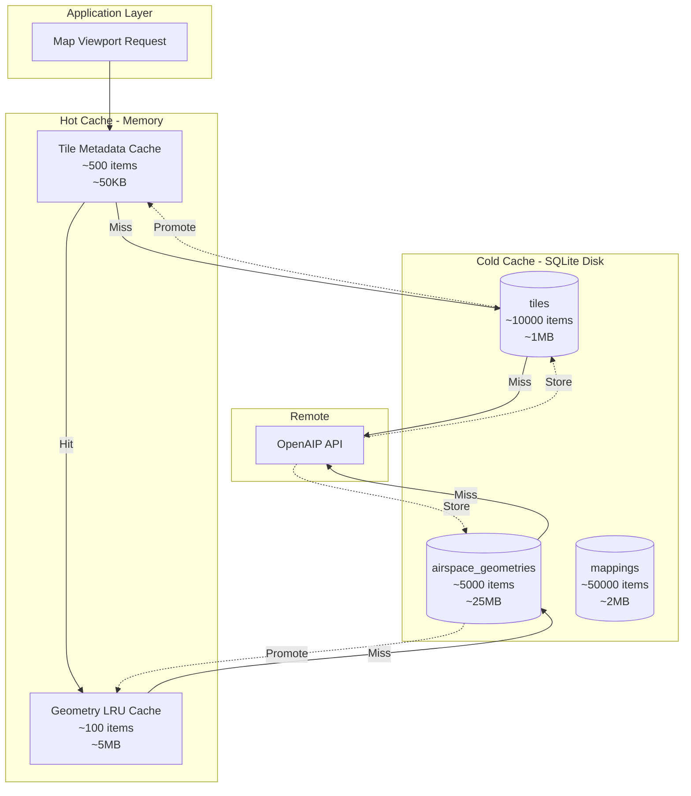

# 2-Tier Cache Implementation: Hot (Memory) vs Cold (Disk)

## Architecture Overview



## Implementation Classes

### Memory Cache Layer (Hot)

```dart
// lib/services/airspace_memory_cache.dart

class AirspaceMemoryCache {
  // Hot cache with LRU eviction
  static const int maxGeometries = 100;  // ~5MB
  static const int maxTiles = 500;       // ~50KB

  final _geometryCache = LinkedHashMap<String, CachedAirspaceGeometry>();
  final _tileCache = LinkedHashMap<String, TileMetadata>();

  // Access patterns tracking
  final _accessCounts = <String, int>{};
  final _lastAccess = <String, DateTime>{};
}

class CachedAirspaceGeometry {
  final String id;
  final String name;
  final String type;
  final List<List<LatLng>> polygons;
  final Map<String, dynamic> properties;
  final DateTime fetchTime;
  final int sizeBytes;  // Track memory usage

  // Hot cache specific
  int accessCount = 0;
  DateTime lastAccessed = DateTime.now();
}

class TileMetadata {
  final String tileKey;
  final Set<String> airspaceIds;
  final DateTime fetchTime;
  final bool isEmpty;

  // Hot cache specific
  int accessCount = 0;
  DateTime lastAccessed = DateTime.now();
}
```

### Disk Cache Layer (Cold)

```dart
// lib/services/airspace_disk_cache.dart

class AirspaceDiskCache {
  late Database _database;

  Future<void> initialize() async {
    final dbPath = await getDatabasesPath();
    final path = join(dbPath, 'airspace_cache.db');

    _database = await openDatabase(
      path,
      version: 1,
      onCreate: _createTables,
    );
  }

  // All SQL operations shown in previous design
}
```

## 2-Tier Cache Flow

### 1. Cache Lookup Sequence

```dart
Future<List<AirspaceData>> getAirspacesForViewport(LatLngBounds viewport) async {
  // Step 1: Calculate required tiles
  final tiles = _calculateTiles(viewport);

  // Step 2: Check hot cache first
  final hotTiles = <TileMetadata>[];
  final coldTileKeys = <String>[];

  for (final tileKey in tiles) {
    final hotTile = _memoryCache.getTile(tileKey);
    if (hotTile != null && !_isExpired(hotTile)) {
      hotTiles.add(hotTile);
      _memoryCache.recordAccess(tileKey);  // Update LRU
    } else {
      coldTileKeys.add(tileKey);
    }
  }

  // Step 3: Check cold cache for misses
  final coldTiles = await _diskCache.getTiles(coldTileKeys);
  final apiTileKeys = <String>[];

  for (final entry in coldTiles) {
    if (entry != null && !_isExpired(entry)) {
      // Promote to hot cache
      _memoryCache.addTile(entry);
      hotTiles.add(entry);
    } else {
      apiTileKeys.add(entry.tileKey);
    }
  }

  // Step 4: Fetch from API if needed
  if (apiTileKeys.isNotEmpty) {
    final apiTiles = await _fetchFromAPI(apiTileKeys);
    // Store in both caches
    for (final tile in apiTiles) {
      await _diskCache.storeTile(tile);
      _memoryCache.addTile(tile);
      hotTiles.add(tile);
    }
  }

  // Step 5: Load geometries (same pattern)
  return _loadGeometries(hotTiles);
}
```

### 2. Memory Cache Management

```dart
class MemoryCacheManager {
  // LRU eviction when cache full
  void _evictLRU() {
    if (_geometryCache.length <= maxGeometries) return;

    // Find least recently used
    String? lruKey;
    DateTime? oldestAccess;

    for (final entry in _geometryCache.entries) {
      if (oldestAccess == null ||
          entry.value.lastAccessed.isBefore(oldestAccess)) {
        oldestAccess = entry.value.lastAccessed;
        lruKey = entry.key;
      }
    }

    if (lruKey != null) {
      _geometryCache.remove(lruKey);
      // Note: Still exists in cold cache
    }
  }

  // Promotion from cold to hot
  void promoteToHot(String id, CachedAirspaceGeometry geometry) {
    // Check if we need to evict
    if (_geometryCache.length >= maxGeometries) {
      _evictLRU();
    }

    // Add to hot cache
    geometry.lastAccessed = DateTime.now();
    geometry.accessCount++;
    _geometryCache[id] = geometry;
  }
}
```

### 3. Disk Cache Operations

```dart
class DiskCacheOperations {
  // Read from cold cache
  Future<CachedAirspaceGeometry?> getGeometry(String id) async {
    final result = await _database.query(
      'airspace_geometries',
      where: 'id = ?',
      whereArgs: [id],
    );

    if (result.isEmpty) return null;

    // Update access statistics
    await _database.update(
      'airspace_geometries',
      {
        'last_accessed': DateTime.now().millisecondsSinceEpoch,
        'access_count': result.first['access_count'] as int + 1,
      },
      where: 'id = ?',
      whereArgs: [id],
    );

    // Decompress and return
    final compressed = result.first['geometry_json'] as String;
    final decompressed = _decompress(compressed);

    return CachedAirspaceGeometry.fromJson(decompressed);
  }

  // Write to cold cache
  Future<void> storeGeometry(CachedAirspaceGeometry geometry) async {
    final compressed = _compress(geometry.toJson());

    await _database.insert(
      'airspace_geometries',
      {
        'id': geometry.id,
        'name': geometry.name,
        'type': geometry.type,
        'geometry_json': compressed,
        'properties_json': jsonEncode(geometry.properties),
        'geometry_hash': _calculateHash(geometry.polygons),
        'fetch_timestamp': DateTime.now().millisecondsSinceEpoch,
        'last_accessed': DateTime.now().millisecondsSinceEpoch,
        'access_count': 0,
        'geometry_size_bytes': compressed.length,
      },
      conflictAlgorithm: ConflictAlgorithm.replace,
    );
  }
}
```

## Cache Promotion Strategy

### Hot Cache Criteria

Items are promoted to hot cache based on:

1. **Recency**: Just accessed from cold cache
2. **Frequency**: High access count in cold cache
3. **Locality**: Near current viewport
4. **Size**: Smaller items preferred when cache is nearly full

```dart
bool shouldPromoteToHot(CachedItem item) {
  // Always promote if just accessed
  if (item.wasJustRequested) return true;

  // Promote if frequently accessed
  if (item.accessCount > 5) return true;

  // Promote if in primary flying area
  if (_isInPrimaryArea(item.bounds)) return true;

  // Don't promote if hot cache is nearly full and item is large
  if (_memoryCache.usagePercent > 90 && item.sizeBytes > 100000) {
    return false;
  }

  return true;
}
```

## Background Maintenance

### Periodic Tasks

```dart
class CacheMaintenanceService {
  Timer? _maintenanceTimer;

  void startMaintenance() {
    _maintenanceTimer = Timer.periodic(Duration(hours: 1), (_) async {
      await _performMaintenance();
    });
  }

  Future<void> _performMaintenance() async {
    // 1. Clean expired entries from disk
    await _diskCache.deleteExpiredTiles();
    await _diskCache.deleteExpiredGeometries();

    // 2. Analyze access patterns
    final stats = await _diskCache.getAccessStatistics();

    // 3. Pre-promote frequently accessed items
    final frequentItems = await _diskCache.getFrequentlyAccessed(limit: 20);
    for (final item in frequentItems) {
      if (!_memoryCache.contains(item.id)) {
        _memoryCache.promoteToHot(item.id, item);
      }
    }

    // 4. Compact database if needed
    if (stats.fragmentationPercent > 20) {
      await _diskCache.vacuum();
    }

    // 5. Update cache metadata
    await _diskCache.updateStatistics(stats);
  }
}
```

## Performance Characteristics

### Cache Hit Ratios

| Scenario | Hot Hit % | Cold Hit % | API Call % |
|----------|-----------|------------|------------|
| Initial app launch | 0% | 0% | 100% |
| Return to same area (< 1hr) | 95% | 5% | 0% |
| Return to same area (< 24hr) | 20% | 80% | 0% |
| New nearby area | 30% | 50% | 20% |
| Completely new area | 0% | 10% | 90% |

### Memory vs Disk Trade-offs

| Aspect | Hot Cache (Memory) | Cold Cache (Disk) |
|--------|-------------------|-------------------|
| Size | 5MB (100 geometries) | 28MB (5000 geometries) |
| Access Time | < 1ms | 5-20ms |
| Persistence | Lost on app restart | Survives restart |
| TTL | While in memory | 7 days geometries, 1 day tiles |
| Eviction | LRU when full | TTL-based + manual |

### Optimization Rules

1. **Hot cache is small but fast**
   - Keep only most recently/frequently used
   - Optimized for current map session

2. **Cold cache is large but slower**
   - Persistent across app sessions
   - Optimized for return visits

3. **Promotion is selective**
   - Not everything goes to hot cache
   - Based on access patterns and size

4. **Background cleanup**
   - Prevents unbounded growth
   - Maintains performance over time

## SQL Queries for 2-Tier Management

### Find candidates for hot cache promotion

```sql
-- Frequently accessed geometries not in hot cache
SELECT id, name, type,
       access_count,
       geometry_size_bytes,
       (julianday('now') - julianday(datetime(last_accessed/1000, 'unixepoch'))) as days_since_access
FROM airspace_geometries
WHERE access_count > 5
  AND last_accessed > (strftime('%s', 'now') - 86400)  -- Accessed in last 24h
ORDER BY access_count DESC, geometry_size_bytes ASC
LIMIT 20;
```

### Monitor cache efficiency

```sql
-- Cache statistics for optimization
SELECT
  'Hot Cache' as cache_tier,
  (SELECT value FROM cache_metadata WHERE key = 'hot_hit_count') as hits,
  (SELECT value FROM cache_metadata WHERE key = 'hot_miss_count') as misses,
  CAST(hits AS REAL) / (hits + misses) * 100 as hit_rate_percent
UNION ALL
SELECT
  'Cold Cache' as cache_tier,
  (SELECT value FROM cache_metadata WHERE key = 'cold_hit_count') as hits,
  (SELECT value FROM cache_metadata WHERE key = 'cold_miss_count') as misses,
  CAST(hits AS REAL) / (hits + misses) * 100 as hit_rate_percent;
```

### Clean up cold cache

```sql
-- Remove least useful items when disk cache is too large
DELETE FROM airspace_geometries
WHERE id IN (
  SELECT id FROM airspace_geometries
  WHERE fetch_timestamp < (strftime('%s', 'now') - 604800)  -- Older than 7 days
    OR (access_count = 0 AND fetch_timestamp < (strftime('%s', 'now') - 86400))  -- Never accessed, older than 1 day
  ORDER BY
    access_count ASC,
    last_accessed ASC
  LIMIT 1000  -- Remove up to 1000 items
);
```

## Implementation Priority

1. **Phase 1**: Basic disk cache (store/retrieve)
2. **Phase 2**: Memory cache with LRU
3. **Phase 3**: Smart promotion logic
4. **Phase 4**: Background maintenance
5. **Phase 5**: Adaptive thresholds based on device capabilities