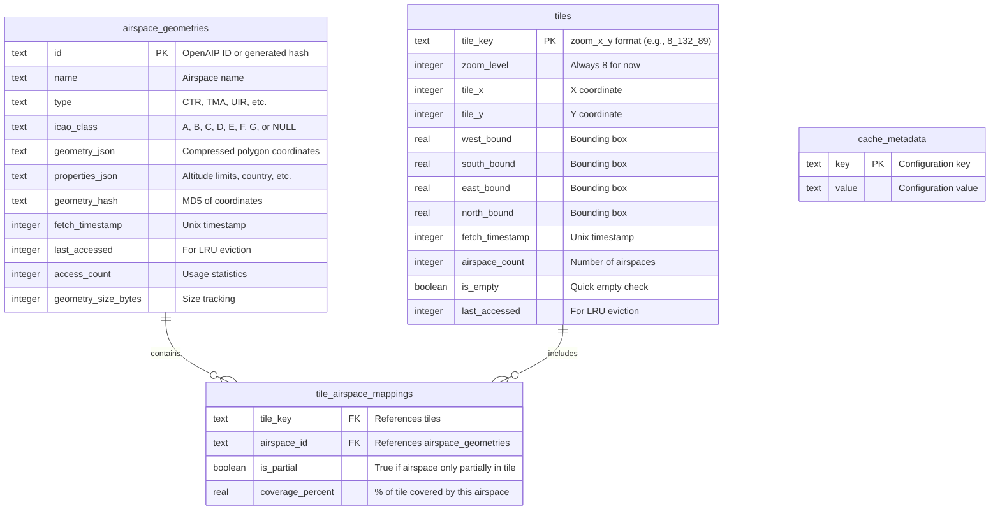

# Airspace Cache SQL Database Design

## Entity Relationship Diagram



## Table Details

### 1. `airspace_geometries` Table
Primary storage for unique airspace polygon data

```sql
CREATE TABLE airspace_geometries (
    id TEXT PRIMARY KEY,                    -- OpenAIP _id or generated hash
    name TEXT NOT NULL,                     -- "FRANCE UIR", "Geneva CTR", etc.
    type TEXT NOT NULL,                     -- "CTR", "TMA", "UIR", "DANGER", etc.
    icao_class TEXT,                        -- "A", "B", "C", "D", "E", "F", "G", NULL
    geometry_json TEXT NOT NULL,            -- Compressed GeoJSON polygon coordinates
    properties_json TEXT,                   -- JSON: altitude limits, country, etc.
    geometry_hash TEXT NOT NULL,            -- MD5 hash for change detection
    fetch_timestamp INTEGER NOT NULL,       -- When fetched from API (Unix timestamp)
    last_accessed INTEGER NOT NULL,         -- Last access time (for LRU)
    access_count INTEGER DEFAULT 0,         -- Number of times accessed
    geometry_size_bytes INTEGER             -- Size of geometry_json (for metrics)
);

CREATE INDEX idx_airspace_type ON airspace_geometries(type);
CREATE INDEX idx_airspace_last_accessed ON airspace_geometries(last_accessed);
CREATE INDEX idx_airspace_fetch_time ON airspace_geometries(fetch_timestamp);
```

### 2. `tiles` Table
Metadata about map tiles

```sql
CREATE TABLE tiles (
    tile_key TEXT PRIMARY KEY,              -- "8_132_89" (zoom_x_y)
    zoom_level INTEGER NOT NULL,            -- 8 (fixed for now)
    tile_x INTEGER NOT NULL,                -- X coordinate (0-255 at zoom 8)
    tile_y INTEGER NOT NULL,                -- Y coordinate (0-255 at zoom 8)
    west_bound REAL NOT NULL,               -- Tile boundary (longitude)
    south_bound REAL NOT NULL,              -- Tile boundary (latitude)
    east_bound REAL NOT NULL,               -- Tile boundary (longitude)
    north_bound REAL NOT NULL,              -- Tile boundary (latitude)
    fetch_timestamp INTEGER NOT NULL,       -- When fetched from API
    airspace_count INTEGER DEFAULT 0,       -- Number of airspaces in tile
    is_empty BOOLEAN DEFAULT FALSE,         -- True if no airspaces
    last_accessed INTEGER NOT NULL          -- For LRU eviction
);

CREATE INDEX idx_tile_coords ON tiles(zoom_level, tile_x, tile_y);
CREATE INDEX idx_tile_last_accessed ON tiles(last_accessed);
CREATE INDEX idx_tile_empty ON tiles(is_empty);
```

### 3. `tile_airspace_mappings` Table
Many-to-many relationship between tiles and airspaces

```sql
CREATE TABLE tile_airspace_mappings (
    tile_key TEXT NOT NULL,                 -- References tiles.tile_key
    airspace_id TEXT NOT NULL,              -- References airspace_geometries.id
    is_partial BOOLEAN DEFAULT TRUE,        -- False if airspace fully within tile
    coverage_percent REAL,                  -- Estimated % of tile covered
    PRIMARY KEY (tile_key, airspace_id),
    FOREIGN KEY (tile_key) REFERENCES tiles(tile_key) ON DELETE CASCADE,
    FOREIGN KEY (airspace_id) REFERENCES airspace_geometries(id) ON DELETE CASCADE
);

CREATE INDEX idx_mapping_tile ON tile_airspace_mappings(tile_key);
CREATE INDEX idx_mapping_airspace ON tile_airspace_mappings(airspace_id);
```

### 4. `cache_metadata` Table
Configuration and statistics

```sql
CREATE TABLE cache_metadata (
    key TEXT PRIMARY KEY,
    value TEXT NOT NULL,
    updated_timestamp INTEGER DEFAULT (strftime('%s', 'now'))
);

-- Initial configuration values
INSERT INTO cache_metadata (key, value) VALUES
    ('schema_version', '1'),
    ('max_geometry_cache_size_mb', '50'),
    ('max_tile_cache_size_mb', '10'),
    ('geometry_ttl_days', '7'),
    ('tile_ttl_days', '1'),
    ('last_cleanup_timestamp', '0'),
    ('total_api_calls', '0'),
    ('cache_hit_count', '0'),
    ('cache_miss_count', '0');
```

## Query Examples

### Get all airspaces for a viewport

```sql
-- Step 1: Find tiles in viewport
WITH viewport_tiles AS (
    SELECT tile_key
    FROM tiles
    WHERE west_bound <= ? AND east_bound >= ?
      AND south_bound <= ? AND north_bound >= ?
      AND fetch_timestamp > (strftime('%s', 'now') - 86400)  -- 24h cache
)
-- Step 2: Get unique airspace IDs from those tiles
, viewport_airspace_ids AS (
    SELECT DISTINCT airspace_id
    FROM tile_airspace_mappings
    WHERE tile_key IN (SELECT tile_key FROM viewport_tiles)
)
-- Step 3: Fetch airspace geometries
SELECT
    id, name, type, icao_class,
    geometry_json, properties_json
FROM airspace_geometries
WHERE id IN (SELECT airspace_id FROM viewport_airspace_ids)
  AND fetch_timestamp > (strftime('%s', 'now') - 604800);  -- 7d cache
```

### Check cache statistics

```sql
SELECT
    (SELECT COUNT(*) FROM airspace_geometries) as geometry_count,
    (SELECT COUNT(*) FROM tiles) as tile_count,
    (SELECT COUNT(*) FROM tiles WHERE is_empty = 1) as empty_tile_count,
    (SELECT SUM(geometry_size_bytes) FROM airspace_geometries) / 1048576.0 as total_geometry_mb,
    (SELECT COUNT(DISTINCT airspace_id) FROM tile_airspace_mappings) as unique_airspaces,
    (SELECT AVG(airspace_count) FROM tiles WHERE is_empty = 0) as avg_airspaces_per_tile,
    (SELECT value FROM cache_metadata WHERE key = 'cache_hit_count') as hits,
    (SELECT value FROM cache_metadata WHERE key = 'cache_miss_count') as misses;
```

### LRU cleanup for memory constraints

```sql
-- Delete least recently used geometries over size limit
DELETE FROM airspace_geometries
WHERE id IN (
    SELECT id FROM airspace_geometries
    ORDER BY last_accessed ASC
    LIMIT (
        SELECT COUNT(*) - 1000  -- Keep max 1000 geometries
        FROM airspace_geometries
    )
);

-- Delete expired tiles
DELETE FROM tiles
WHERE fetch_timestamp < (strftime('%s', 'now') - 86400);  -- 24h expiry
```

### Find duplicate airspaces across tiles

```sql
-- Diagnostic query to show duplication savings
SELECT
    a.name,
    a.type,
    COUNT(DISTINCT m.tile_key) as tile_count,
    a.geometry_size_bytes / 1024.0 as size_kb,
    (COUNT(DISTINCT m.tile_key) * a.geometry_size_bytes) / 1024.0 as would_be_duplicated_kb,
    a.geometry_size_bytes / 1024.0 as actual_stored_kb
FROM airspace_geometries a
JOIN tile_airspace_mappings m ON a.id = m.airspace_id
GROUP BY a.id
HAVING COUNT(DISTINCT m.tile_key) > 1
ORDER BY tile_count DESC;
```

## Migration from Current System

```sql
-- Migration procedure (pseudo-code)
BEGIN TRANSACTION;

-- 1. Create new tables
-- (CREATE TABLE statements above)

-- 2. For each cached tile in memory:
--    a. Parse GeoJSON response
--    b. Extract unique airspaces
--    c. INSERT OR IGNORE into airspace_geometries
--    d. INSERT tile metadata into tiles
--    e. INSERT relationships into tile_airspace_mappings

-- 3. Update cache_metadata with current statistics

COMMIT;
```

## Size Estimates

With typical usage patterns:

| Table | Rows | Size |
|-------|------|------|
| airspace_geometries | ~5,000 | ~25 MB |
| tiles | ~10,000 | ~1 MB |
| tile_airspace_mappings | ~50,000 | ~2 MB |
| cache_metadata | ~20 | ~1 KB |
| **Total** | **~65,000** | **~28 MB** |

Compare to current approach:
- Memory cache: 200 tiles × 10-50KB = 2-10 MB (but with massive duplication)
- New approach: 28 MB on disk, 2-3 MB in memory (hot cache), no duplication