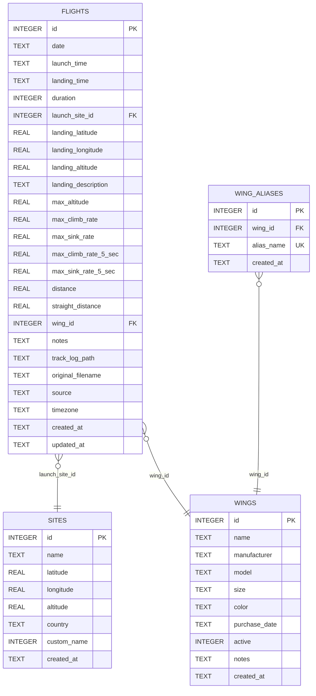

# Database Entity Relationship Diagram

## Visual ERD

## Relationships

### One-to-Many Relationships

1. **SITES → FLIGHTS** (1:N)
   - A site can have many flights launched from it
   - A flight has one launch site (optional)
   - Foreign key: `flights.launch_site_id` → `sites.id`

2. **WINGS → FLIGHTS** (1:N)
   - A wing can be used for many flights
   - A flight uses one wing (optional)
   - Foreign key: `flights.wing_id` → `wings.id`

3. **WINGS → WING_ALIASES** (1:N)
   - A wing can have multiple aliases
   - An alias belongs to one wing
   - Foreign key: `wing_aliases.wing_id` → `wings.id`
   - Cascade delete: When a wing is deleted, its aliases are also deleted

## Entity Details

### FLIGHTS Table

- **Primary Key**: `id` (auto-increment)
- **Foreign Keys**:
  - `launch_site_id` → `sites.id`
  - `wing_id` → `wings.id`
- **Constraints**:
  - `source` must be one of: 'manual', 'igc', 'parajournal'
- **Indexes**:
  - `idx_flights_launch_site` on `launch_site_id`
  - `idx_flights_wing` on `wing_id`
  - `idx_flights_date_time` on `date DESC, launch_time DESC`

### SITES Table

- **Primary Key**: `id` (auto-increment)
- **No foreign keys**
- **No additional indexes**

### WINGS Table

- **Primary Key**: `id` (auto-increment)
- **No foreign keys**
- **No additional indexes**

### WING_ALIASES Table

- **Primary Key**: `id` (auto-increment)
- **Foreign Key**: `wing_id` → `wings.id` (with CASCADE DELETE)
- **Unique Constraint**: `alias_name`
- **Indexes**:
  - `idx_wing_aliases_wing_id` on `wing_id`
  - `idx_wing_aliases_alias_name` on `alias_name`

## Database Properties

- **Database Name**: FlightLog.db
- **Current Version**: 10
- **Storage**: SQLite
- **Optimized for**: <5000 flights, <100 sites, <10 wings
